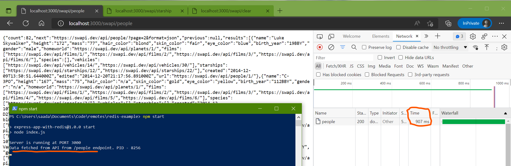
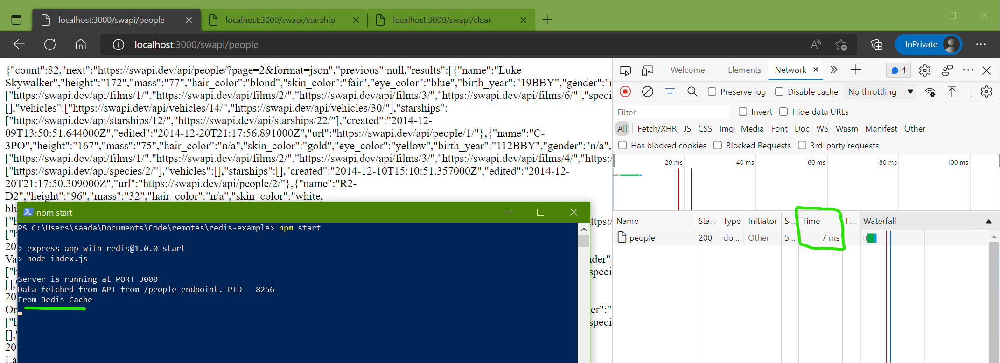
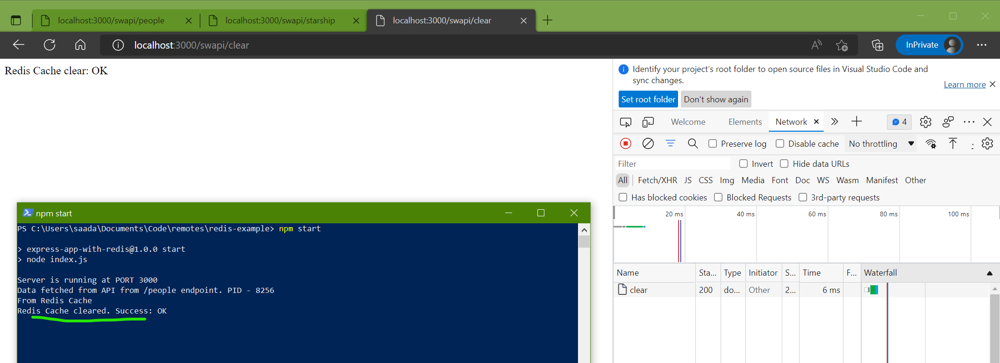

# ExpressJS with Redis Cache (POC)

Redis Cache is an in-memory data structure to store key/ value pairs which is really really fast!

Pre-requisites:
* npm
* Docker

### Redis

Pull the Redis image (redis:latest) from the DockerHub and run it as a container.

<code>docker pull redis:latest</code>

By default Redis runs on PORT 6379

### ExpressJS

Clone this repo and install the dependencies using:

<code>npm install</code>

Downloads all the required packages

Usage:
* <code>npm start</code>
* <code>node index.js</code>

Exposed endpoint(s):

* localhost:3000/swapi/ - ExpressJS with Redis endpoint
* localhost:3000/swapi/clear - **CLEAR** the redis cache
* localhost:3000/swapi/people - **SET** to cache
* localhost:3000/swapi/starship - **SETEX** to cache with TTL of 20s

## Demo:

If we browse to http://localhost:3000/swapi/people for the first time, we get a delayed response taking 907ms, as this is a cache miss since the data is not set in the cache initially.

But soon again if we browse to the same URL for the second time, we get a very fast response taking **ONLY** 7ms, as this is a cache hit response directly from Redis

To clear the Redis cache, we have this endpoint: http://localhost:3000/swapi/clear

